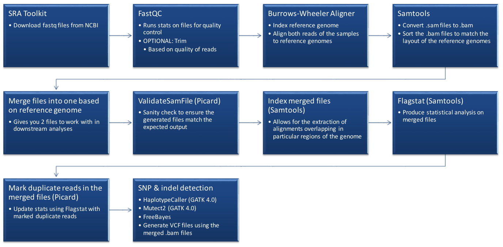

# AU_BIOL-7180_SPR20_GroupProject
This GitHub will be dedicated to organizing the efforts made by students learning biological scripting to analyzing real datasets for a class group project.
Raw read data can be found in the following directory in scratch and in the shared box folder:
/scratch/AU_BIOL-7180_GrpProject/samples_Salmonella_muenster

## Background
Salmonella Gram-Negative Bacilli

## Reference Genomes and Assemblies Used
1. [Traditional NCBI Refernce: _Salmonella enterica CVM N51250 v1.0_ (SER) Salmonella enterica subsp. enterica serovar Muenster (enterobacteria)](https://www.ncbi.nlm.nih.gov/assembly/GCF_001246125.1)
2. Ray Assembly of WT-2012 (scaffolds): SER_ray
3. Ray Assembly of WT-2012 (contig): SER_rayc
4. SPAdes Assembly of WT-2012: SER_spades

|Reference| Genome Assembly Size|
|---|---|
| _Salmonella enterica CVM N51250 v1.0_ | 4.7 Mbp|
| SER_ray | 4.8 Mbp |
| SER_rayc | 4.8 Mbp |
| SER_spades | 4.8 Mbp |

## General Workflow
<p align="center">

</p>

1. Obtain raw reads using SRA Toolkit fastqDump.

2. FastQC was utilized for basic quality control metrics of raw MiSeq sequencing data.[See Resulting Output](https://github.com/asw0049/AU_BIOL-7180_SPR20_GroupProject/tree/master/fastQC)

3. Analyzed data for trimming (Step skipped)

4. BWA for aligining reads to reference genomes and assemblies. BWA was used to do the following:
   
   a. Create an index for the reference genomes ([script 4](https://github.com/asw0049/AU_BIOL-7180_SPR20_GroupProject/blob/master/Completed_scripts/4_bwa_index2.sh))
    
   b. Align the samples we have to both reference genomes ([script 5](https://github.com/asw0049/AU_BIOL-7180_SPR20_GroupProject/blob/master/Completed_scripts/5_bwa_mem.sh)) INPUT FILE: .fastq.gz    OUTPUT FILE: .aln.sam
   
   c. Convert the aligned files to an extension the BWA could use to sort and merge files based on reference genome aligned to ([script 6](https://github.com/asw0049/AU_BIOL-7180_SPR20_GroupProject/blob/master/Completed_scripts/6_bwa_merge.sh)) INPUT FILE: .aln.sam     OUTPUT FILE: .sorted.merged.bam
	
5. Generate phylogeny of samples using CSIPhylogeny. Tree edit with Mega X.

   
## SNP Analysis from Vcf files
Mutect2 is a vcf generating somatic variant caller. HaplotypeCaller is a took of GATK that calls variands by default with diploid ploidy, but can have ploidy specifed. And FreeBayes is a variant caller commonly ustilized for varaint calling in haploid samples. Here, we opted to do a comparision of the variant calling quality for these three popular variant calling tools. Summary stats of the vcf files genertaed using **bcftools stats** and **plot-vcfstats**. The stats are represented below.

```
Supplementary code to generate stats file(s):

module load bcftools
module load samtools

#Run bcftools stats to genertae stats on vcf file to be used in python to genrate plot. This is the input for plot-vcfstats
bcftools stats WT_2012_ref_assemblyc.unfiltered.vcf > ./plot_aw/WT_2012_ref_assemblyc.unfiltered.vchk

#Run plot-vcfstats under bcftools. Be sure to have python3-matplotlib installed as this is a dependency.
##For matplotlib run : sudo apt-get install python3-matplotlib
plot-vcfstats WT_2012_ref_assemblyc.unfiltered.vchk -p ./unflit_assembly_plot/ 

```
Files Generated By plot-vcfstats:
```
counts_by_af.indels.dat  depth.0.dat  depth.0.png   indels.0.pdf  plot-vcfstats.log  substitutions.0.pdf  tstv_by_af.0.dat    tstv_by_qual.0.pdf
counts_by_af.snps.dat    depth.0.pdf  indels.0.dat  indels.0.png  plot.py            substitutions.0.png  tstv_by_qual.0.dat  tstv_by_qual.0.png
```
Run python3 on polt.py script:
```
#Use python3 to plot data generated in plot.py script and produce png graph files.
python3 plot.py 
```
##### Table-1
| Reference | indels | snps | transitions | transversions | mnp<sup>1 | other | mas<sup>2 | ts/tv<sup>3 | Variant Caller |
|---|---|---|---|---|---|---|---|---|---|
| _Salmonella enterica CVM N51250 v1.0_ | 49 | 2017 | 1073 | 944 | 436 | 9 | 0 | 1.136653 | FreeBayes |
| WT_2012_Ray_Scaffold | 18 | 1367 | 434 | 933 | 77 | 5 | 9 | 0.465166 | FreeBayes |
| WT_2012_Ray_Contigs |18 | 1351 | 437 | 914 | 77 | 5 | 9 |0.478118 | FreeBayes |
| _Salmonella enterica CVM N51250 v1.0_ | 239 | 1966 | 1221 | 745 | 0 | 7828 | 2007 | 1.638926 | HaplotypeCaller |
| WT_2012_Ray_Scaffold | 27 | 553 | 140 | 413 | 0 | 5467 | 467 | 0.338983 | HaplotypeCaller |
| WT_2012_Ray_Contigs |24 | 553 | 139 | 414 | 0 | 5442 | 466 | 0.335749 | HaplotypeCaller |
| WT_2012_Ray_Contigs | 614 | 1062 | 448 | 614 | 53 | 0 | 10 | 0.729642 | Mutect2 |

##### Table-1 Notes
1-Multi Nucleotide Polymorphism (mnp)

2-Multiallelic sites (mas)

3-Transition to transversion raio (ts/tv)

### Rplots of SNPs Detected

#### Example Script for generating R plots
```
library(ggplot2)
p1<-ggplot(data=INSERT_DATAFILE_HERE, aes(x=Reference, y=other)) + geom_bar(stat="identity",  width=0.5, fill="black")+ coord_flip()
p2<-ggplot(data=INSERT_DATAFILE_HERE, aes(x=Reference, y=other)) + geom_bar(stat="identity",  width=0.5, fill="black")+ coord_flip()+ ylim(NA, 40)
gridExtra::grid.arrange(p7, top= "INSERT_TITLE_HERE")
gridExtra::grid.arrange(p6, top= "INSERT_TITLE_HERE")

```

SNPs and Indels Detected Using FreeBayes and Mutect2 | SNPs and Indels Detected Using HaplotypeCaller and Mutect2
:---------------------------------------------------:|:---------------------------------------------------------:
| |


Transitions and Transversions Detected Using FreeBayes and Mutect2 | Transitions and Transversions Detected Using HaplotypeCaller and Mutect2
:---------------------------------------------------:|:---------------------------------------------------------:
||


Other SNPS Detected Using FreeBayes and Mutect2 | Other SNPs Detected Using HaplotypeCaller and Mutect2
:---------------------------------------------------:|:---------------------------------------------------------:
||

## fastq2vcf tool
Within the **TestFile** directory and on the main GitHub page is the script **fastq2vcf.sh** which can be run in the ASC and submitted to the queue system. This script is an automated version of our pipeline and will perform all steps with the exception of trimming fastq files. The script is designed to download fastq files using SRA toolkit's fastq-dump will ultimately gernerate files needed for viewing data on the Integrative Genome Viewer (IGV), VCF files based on user input for ploidy, and stats files of the VCF (ends in .vchk). All files except index files, dictionary files, and other reference file dependent files are organized into directories as part of a final cleanup step. Within the script, users must define thre variables, **"ref="**, **"input_file="**, and **"ploidy="**. 

Note: No space should be added between the "=" and user information.

### User-Defined Variables

**ref=** basename of fasta file (_Example: for Salmonella.fasta, put_ Salmonella)

**input_file=** name of file with list of SRR number to be downloaded with fastq-dump (_Example:_ sample_list.txt)

**ploidy=** ploidy of organism from samples (_Example: for Salmonella.fasta, put_ 1)

**Note about ploidy**- If teh defined ploidy =1, FreeBayes will be called. Any other ploidy will call HaplotypeCaller.

#### Sample datasets are provided in the TestFile folder.
Salmonella.fasta (haploid)

sample_list.txt (haploid-Bacterial isolates from this project)

covid-19_MT039887.1.fasta (Negative control)

sample_list2.txt (diploid-Human)

#### Dependencies
**bwa/0.7.12**

**samtools/1.3.1**

**picard/1.79**

**gatk/4.1.4.0**

**freebayes/1.0.2

**sra**

**fastqc/0.10.1**

##### Author contributions are listed in Contributions.md. [Contributions]

Ashley Williams (email :asw0049@auburn.edu)

Shelby Osburn

Steven Kitchens
