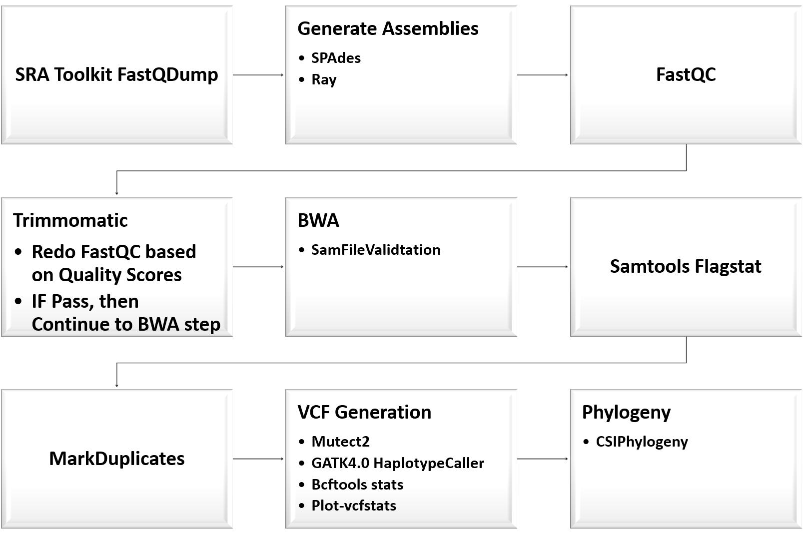

# AU_BIOL-7180_SPR20_GroupProject
This GitHub will be dedicated to organizing the efforts made by students learning biological scripting to analyzing real datasets for a class group project.
Raw read data can be found in the following directory in scratch and in the shared box folder:
/scratch/AU_BIOL-7180_GrpProject/samples_Salmonella_muenster

## Background
Salmonella Gram-Negative Bacilli

## Reference Genomes and Assemblies Used
1. [Traditional NCBI Refernce: _Salmonella enterica CVM N51250 v1.0_ (SER)](https://www.ncbi.nlm.nih.gov/assembly/GCF_001246125.1)
2. Ray Assembly of WT-2012 (scaffolds): SER_ray
3. Ray Assembly of WT-2012 (contig): SER_rayc
4. SPAdes Assembly of WT-2012: SER_spades

|Reference| Genome Assembly Size|
|---|---|
| _Salmonella enterica CVM N51250 v1.0_ | 4.7 Mbp|
| SER_ray | 4.8 Mbp |
| SER_rayc | 4.8 Mbp |
| SER_spades | 4.8 Mbp |

## General Workflow
<p align="center">

</p>

1. Obtain raw reads using SRA Toolkit fastqDump.

2. FastQC was utilized for basic quality control metrics of raw MiSeq sequencing data.[Step 2](https://github.com/asw0049/AU_BIOL-7180_SPR20_GroupProject/tree/master/fastQC)

3. Analyzed data for trimming (Step skipped)

4. BWA for aligining reads to reference genomes and assemblies.
	BWA was used to do the following:
    Create an index for the reference genomes (script 4)
    Align the samples we have to both reference genomes (script 5)                      
        INPUT FILE: .fastq.gz    OUTPUT FILE: .aln.sam
    Convert the aligned files to an extension the BWA could use to sort and merge files based on reference genome aligned to (script 6)
        INPUT FILE: .aln.sam     OUTPUT FILE: .sorted.merged.bam
	
5. Generate phylogeny of samples using CSIPhylogeny. Tree edit with Mega X.

   
## SNP Analysis from Vcf files
Mutect2 is a vcf generating somatic variant caller. HaplotypeCaller is a took of GATK that calls variands by default with diploid ploidy, but can have ploidy specifed. And FreeBayes is a variant caller commonly ustilized for varaint calling in haploid samples. Here, we opted to do a comparision of the variant calling quality for these three popular variant calling tools. Summary stats of the vcf files genertaed using **bcftools stats** and **plot-vcfstats**. The stats are represented below.

```
Supplementary code to generate stats file(s):

module load bcftools
module load samtools

#Run bcftools stats to genertae stats on vcf file to be used in python to genrate plot. This is the input for plot-vcfstats
bcftools stats WT_2012_ref_assemblyc.unfiltered.vcf > ./plot_aw/WT_2012_ref_assemblyc.unfiltered.vchk

#Run plot-vcfstats under bcftools. Be sure to have python3-matplotlib installed as this is a dependency.
##For matplotlib run : sudo apt-get install python3-matplotlib
plot-vcfstats WT_2012_ref_assemblyc.unfiltered.vchk -p ./unflit_assembly_plot/ 

```
Files Generated By plot-vcfstats:
```
counts_by_af.indels.dat  depth.0.dat  depth.0.png   indels.0.pdf  plot-vcfstats.log  substitutions.0.pdf  tstv_by_af.0.dat    tstv_by_qual.0.pdf
counts_by_af.snps.dat    depth.0.pdf  indels.0.dat  indels.0.png  plot.py            substitutions.0.png  tstv_by_qual.0.dat  tstv_by_qual.0.png
```
Run python3 on polt.py script:
```
#Use python3 to plot data gnerated in plot.py script and produce png graph files.
python3 plot.py 
```
| Ref | indels | snps | ts | tv | mnp | other | mas | ts/tv | Variant Caller |
|---|---|---|---|---|---|---|---|---|---|
| _Salmonella enterica CVM N51250 v1.0_ | 49 | 2017 | 1073 | 944 | 436 | 9 | 0 | 1.136653 | FreeBayes |
| WT_2012_Ray_Scaffold | 18 | 1367 | 434 | 933 | 77 | 5 | 9 | 0.465166 | FreeBayes |
| WT_2012_Ray_Contigs |18 | 1351 | 437 | 914 | 77 | 5 | 9 |0.478118 | FreeBayes |
| _Salmonella enterica CVM N51250 v1.0_ | 239 | 1966 | 1221 | 745 | 0 | 7828 | 2007 | 1.638926 | HaplotypeCaller |
| WT_2012_Ray_Scaffold | 27 | 553 | 140 | 413 | 0 | 5467 | 467 | 0.338983 | HaplotypeCaller |
| WT_2012_Ray_Contigs |24 | 553 | 139 | 414 | 0 | 5442 | 466 | 0.335749 | HaplotypeCaller |
| WT_2012_Ray_Contigs | 614 | 1062 | 448 | 614 | 53 | 0 | 10 | 0.729642 | Mutect2 |


SNPs and Indels Detected Using FreeBayes and Mutect2 | SNPs and Indels Detected Using HaplotypeCaller and Mutect2
:---------------------------------------------------:|:---------------------------------------------------------:
 | 
 |

Transitions and Transversions Detected Using FreeBayes and Mutect2 | Transitions and Transversions Detected Using HaplotypeCaller and Mutect2
:---------------------------------------------------:|:---------------------------------------------------------:
 |
|

Author contributions are listed in Contributions.md. [Contributions]
